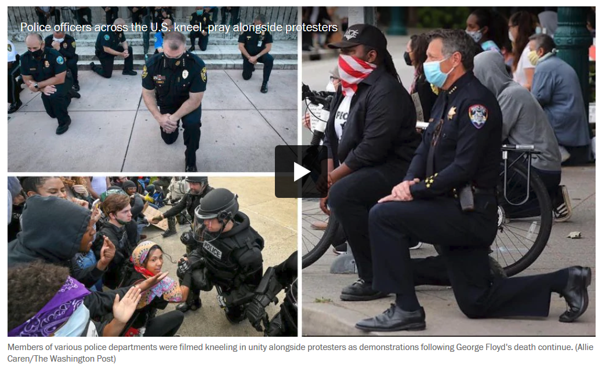

# 独立人格从何而来？

写作于2020年6月21日

（画面摘自[《华盛顿邮报》一篇报道](https://www.washingtonpost.com/nation/2020/06/01/some-officers-march-kneel-with-protesters-creating-dissonant-images-fraught-weekend-uprisings/)）

## 美国警察的单膝下跪

非裔美国人乔治·佩里·弗洛伊德（George Perry Floyd）因警察过度暴力死亡的事件，在美国和世界范围内引起了轩然大波。事件本身不是我在这里要讨论的。在关于示威游行的报道中，也有一些特别的画面引起了我的思考。除了警察和示威群众冲突的画面，也在美国多处出现了这些警察在示威群众面前单膝下跪的画面。

单膝下跪这个动作本身，对亚洲读者需要做一点解释，以免误读。它和我们华人通常讲的，做错事，跪搓衣板，以表认错悔改的双膝下跪不同。至少，在这次事件的背景下，这样举动的涵义，则是联系到三四年前萌发于美国旧金山的一场橄榄球比赛。比赛前，一名队员在美国国歌奏响的时候单膝下跪，抗议白人警察20发子弹连击一名拒绝弃刀的黑人，抗议种族歧视。这个动作，虽然受到特朗普的反对，被全美橄榄球联盟禁止，仍然如燎原星火，成为人人效仿的经典，成了和平抗议的象征。 单膝下跪虽然也有道歉的意思，但更多的是表示认同、尊敬，表达的是一种声援和平抗议。当然不同的场合，这样的举动的内涵是很丰富的，无法一概而论，这里只是非常概要的解读。

但引起我思考和感慨的是，这些画面与许多其他警察镇压示威群众的画面形成的对比。我自己常常好奇，那些警察在镇压示威群众时，内心是怎样的感受。美国警察的单膝下跪的举动，是一个窗口，让我看到，这些警察并不是在机械的执行一个命令。他们也有他们自己独立的思考和情感。这种举动，显然不是上级的指示，而是他们自发的举动。这对警察这个职业来说，尤其难能可贵。警察和士兵类似，基本的训练和要求就是对上级指示完全的服从。美国警察的这些个性化的举动，让我看到至少两点：1）在美国的文化下，哪怕在军队和警察里，仍然有这种个人表达的空间。我相信这些警察，不会因为他们这样的举动，回头受到警告或处罚。2）美国的警察，有这样一种表达他们独立思想的能力、勇气和意愿。警察并不只是一群冷血的暴力机器人，他们也有血有肉，有情感，有思想。一方面，他们服从上级的指示，执行上级防暴治安的任务，同时他们有他们个人明确的思考和认同。

美国人这种独立思考的精神，正是我感慨我们东方人和东方社会所缺乏的。华人文化中，在春秋战国时，还有百家争鸣的思想盛况。但到了汉代，很快被“罢黜百家，独尊儒术”这种大一统的思想所取代。服从、效忠的思想成了唯一的”主旋律“。几千年以来，这种“万马齐喑”的文化和思想的贫瘠和悲哀，一直延续到几天，并没有因为中国经济的腾飞，赶英超日，而发生改变。

## 风暴兵的觉醒

星球大战系列中，有一集叫《原力觉醒The Force Awakens》。我是在一次飞机旅途中，看了个大概。剧情中引起我兴趣的剧情是，一个在前面系列中，一直是跑龙套的风暴兵，成了这集中的主角。风暴兵，在前面系列中，给人的感觉就是千面一律，没有思想，没有情感，只是执行命令的机器。但这集中刻画了一个编号FN-2187的风暴兵，克隆人，逐渐找回他的人性，形成他的独立思考，脱下头盔，成为一个独立的绝地战士的故事。我觉得，这是在星战系列中，比较有深度的一段剧情。这种对独立人格的反省，其实是贯穿整个星球大战系列的宏大主题之一。星战中的黑色帝国，就是以二战中的纳粹帝国为原型，这种对国家和军队实施的整齐划一的管理，短时间内确实可以产生出强大的政治和军事力量。星战中批量克隆生产的风暴兵，正是二战中被狂热的纳粹思想奴役的德国士兵的写照。而绝地战士代表的则是，在西方民主自由之下，真正有灵魂的独立的人。这样看来，黑色帝国虽然是明显的在隐喻纳粹德国，也同样能喻指二战中日本的军国主义，以及后来冷战中的共产主义。星战体现了西方文化中时常对独立人格做出的反思。比如在现代大规模教育体系下，如何不让学生丧失独立思考能力，如何培养他们独立的人格；在现代资本主义大规模生产下，在对效率、规模和利润的追求中，如何不泯灭员工的人性，沦为机器的附庸和配件，等等。

我无法以有限的篇幅，在这里就独立思想和独立人格的重要性，在这里展开讨论。但在西方文化中，独立思想和独立人格，是一个人之所以成为人的一种要素。而从东西方文化中，下跪这个举动的差异中也能管窥两种文化的差异。西方文化中的下跪，一般是单膝下跪。我们常看到的，比如男性向女性求婚，臣民向女王下跪，采用的都是这种姿势。而东方的下跪，一般是双膝下跪。东方的下跪，表示的是一种服从、孝敬和效忠，但在这个强调服从的过程中，往往也泯灭了人的个性和独立性。而西方的单膝下跪，一方面有表示尊敬、服从的意思；但另一膝半立，也表示了一种保留自我、一种强调独立的精神。**这种服从与独立精神的融合，集体与个人利益的平衡，是一个社会健康发展的根基所在**。片面强调一方，而压制另一方，都会成为一种不健全的社会。

## 独立人格从何而来？

那么这种，独立精神、独立人格从何而来呢？

这同样是个大问题。不同的人文学者，思想家，哲学家可能会给出不同的答案。这里，我分享一个人物见证，做为我个人对这个问题给出的答案。这个人就是杨小凯。在写这篇文章之前，我并不知道杨小凯这个人，算是我见识的短浅。是在酝酿这篇文章，在网上搜索资料时，才偶然读到介绍杨小凯的文章。

杨小凯可以说是中国知识分子当中，少数能有独立思考能力，并且敢于的表达的人。中国文革时期，如我们都知道的，是一段像二战纳粹德国一样狂热的时期。1968年，年仅19岁的杨小凯因为写下一篇名为《中国向何处去》的大字报，而被入狱十年。如果说，《中国向何处去》已经体现出杨身上那种不愿人云亦云、敢于独立思考的精神的话。十年的牢狱经历，则使这种精神，进一步的涅槃升华。

从我简单搜集到的资料来看，在监狱里，有两个人，给了杨小凯深刻的影响。一个是刘凤翔，他对杨小凯产生了非常重要的影响，是杨小凯思想的启蒙者。“刘凤翔非常语重心长地告诫他说：‘你们这代人，不要再沉浸在法国革命，欧洲革命和苏俄革命的红色极端的光圈里，你们应该从这样一个历史循环链条中走出来。你们要认真学学英国的历史，要学习英美宪政的历史，同时要懂经济，要成为经济学家。’这些话给杨小凯带来巨大的震撼。毕竟他当时还只是个20多岁的年轻人，他还是第一次听说英美保守主义传统、宪政民主的传统......"。

第二个在狱中深刻杨小凯的则是他在狱中遇到的一位基督徒。”杨小凯是一个基督徒，他非常虔诚地皈依了基督。他最先接触基督教是在1968年，他进入牢房后，他遇到一个基督徒，这个基督徒一直在帮助别人。即使在非常艰难的情况下，他表现得也非常淡定。这个基督徒因为写了一张大字报被判处了10年徒刑，他在监狱时，在当年那样高压的政治环境下，他从来没有表现出害怕或恐惧。他除了自己每天祷告，还为同房的牢友们祷告，他说是上帝让他承受苦难。这个人对杨小凯影响很大。

杨小凯有很多精神层面的思考和他对基督教的研究是分不开的，他的脑海中是有一种终极关怀和神学理念的。杨小凯自己在文章中曾经回忆，他认为自己比较系统地接受基督教理念是受到了哈耶克的影响。他读了哈耶克的著作后，发现一个重要观念，即：自由能够使社会秩序不断扩张。那么他在研究基督教的过程当中发现：在经济上能够使社会自由秩序不断扩张的只有基督教。他认为基督教，特别使基督新教对经济发展对世界和平，也就是圣经中所说的‘永久和平和公正的秩序’起着促进作用......“

在这里，我只是简略的摘录了在我看来，让杨小凯形成独立思考和独立人格的关键事件和人物。有兴趣了解更多的，可以去网上搜索他的资料。

我在这里要给出的我个人的答案，就是：**独立人格，从真正的信仰而来**。

有些人，可能不屑于这样的答案。认为宗教信仰，都是在桎梏人的思想，是精神鸦片。不错，但真正的信仰失去了内在实质时，就会沦为一种教条的宗教，从而禁锢人的思想。中世纪的天主教就是这样，而宗教改革使基督教再次回到信仰的本质上来。有些人，可能会认为，独立的人格来自科学精神，或民主、自由这类启蒙思想的熏陶。但现代的科学精神，还有民主、自由这些思想，在我看来，都离不开圣经的启示，是圣经真理带来的真正独立人格所结出的果实。（在古希腊会有苏格拉底、柏拉图这类古代的思想家、哲学家，他们独立的思想，来自他们里头还未泯灭的良知。而这种良知，来自神造人时，所赐给人的神的形象和样式。）

*耶稣基督说：你们必晓得真理，真理必叫你们得以自由......我来是要叫人得生命，并且得的更丰盛！* （约8:32，10:10）

杨小凯生命的经历，仿佛就是星球大战中那个觉醒的风暴兵的真人版，其实也是我们每个基督徒，生命重生，死里复活的经历。曾在黑暗权势的辖管和奴役之下，但被基督的宝血唤醒，从黑暗中释放出来，进入光明，不仅得晓真理，更得着真正的真理的自由，和无比丰盛的生命。

今天的教会，如果只是教条的、机械的教导圣经，灌输教义，而忽略了对信徒独立性和自主性的塑造和培养，离弃了宗教改革的精髓之一 - 信徒皆祭司的精神，教会将再次陷入中世纪的黑暗。

*"主的灵在哪里，那里就得以自由。"*  （林后3:17）

愿主自由的灵与今天的教会同在，与每个真正的信徒同在！

参考资料：

- [杨小凯：中国的后发劣势已现](https://xw.qq.com/cul/2015120202212800)