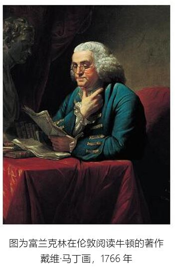

# 好读书的富兰克林

写作于：2019年2月22日            发布于：2020年7月31日

提起美国的富兰克林，大家都不会陌生。他是十八世纪美国伟大的科学 家和发明家，美国独立战争的伟大领袖，被称为“第一个美国人 the First American”。富兰克林的一生是个传奇，他什么都会，什么都懂。如果今天有谁能又懂物理，又懂数学，又时不时地写点漂亮的文章，从商又从政呢！美国 第一任总统华盛顿曾说：“在我的一生中，能让我佩服的人只有三位，第一位是富兰克 林，第二位也 是富兰克林，第三位还是富兰克林。”这位富兰克林是何许人，竟然能让华盛顿如此推崇？一个只接受过两年的教育的人，如何取得这么多辉煌的，跨领域的成就呢？

他曾为自己写过这样的墓志铭：“印刷业者本杰明·富兰克林的身体（你一本旧书皮，内容已经撕掉，书面的印字和烫金也剥掉了）长 眠于此，作蛆虫的食物。然而，作品本身绝不致泯灭，因为他深信它将重新出版，经过作者加以校正和修饰，成为一种簇新的更美丽的版本。”富兰克 林一生中拥有许多个第一，如美国第一位学者，第一位哲学家，第一位驻外大使，近代牙科医术之父等。他还自修了法文、西班牙文、意大利文、拉丁文，并引导美 国走上独立之路。这么多“头衔”搁着不用，为什么偏偏写上这一“卑微”职业呢？

墓志铭一方面反映了富兰克林的谦卑，从一个侧面反映了富兰克林对书的深厚感情。道出了他“成功的秘诀”。是好书（包括圣经）和好（喜好）书造就了富兰克林。

## 从事印刷

富兰克林从小就喜欢读书，因为对书籍的爱好，他的父亲最终决定让他去学印刷工，而这一职业对富兰克林以后的事业大有裨益。20岁的富兰克林重返印刷业，富 兰克林设法用模具造了一套印刷所需的铅字，成为北美殖民地第一个制造铅字的人。如今我们经常使用的字体中，有一种无衬线字体便是以他的名字命名 ——“富兰克林哥特体”。这种字体经常使用于报纸头条的印刷。后来富兰克林又接到印刷纸币的生意，于是 设计了一套铜版印刷机。他还发清楚明了双焦距眼镜、新式清洁火炉；绘制了第一张墨西哥湾洋流图。

## 好读书

图为富兰克林在伦敦阅读牛顿的著作 戴维·马丁画，1766年

他酷爱读书，书籍改变了富兰克林的一生。12岁的富兰克林跟随着哥哥进入了印刷业，他经常从书店老板的学徒那 儿借书看。因为第二天一早就要归还，所以他常大半个夜晚都在房间里读书。他阅读的范围很广，从自然科学、技术方面的通俗读物到著名科学家的论文以及名作家 的作品都是他阅读的范围。他读了丹尼尔·笛福的《论计划》，科顿·马瑟的《论行善》，最喜欢的书是约翰· 班扬的《天路历程》和普鲁塔克的《希腊罗马名人传》，一个12岁的小孩竟然能有这样的阅读品位！

此后，无论他在伦敦还是费城，甚至在他以后事业有成、享负盛名之时，他总是要挤出时间来阅读，让自己每天有一两个小时的 时间可以读书，也因为这个习惯，让他最终取得了成功。这些书告诉富兰克林，每一个人都是在实践中获取智慧，不断自我完善。这帮助了富兰克林价值观的形成，并且对于他之后的主张起到了重要作用。
因为要省下钱来买书，富兰克林在当学徒时养成了素食的习惯，同时他也觉得饮食上的节制让他头脑更加清晰。即使破了“戒”，他也会用奇怪的理由来说服自己。

 

## 勤写作

在当印刷学徒期间，富兰克林开始尝试写诗和文章，他自学并借鉴了约瑟夫· 艾迪生和理查德·斯蒂尔的写作方法，形成了自己风趣幽默、明晰直白的写作气势派头，后来他接管了由哥哥创办的《新英格兰报》，负责出版和发行，还成为北美殖民地最受欢迎的作家之一。 

富兰克林的写作，也是从模仿借鉴开始的。他会选择优秀的文章，先做成摘要搁置几天忘记后，根据摘要重写，对比原文寻找差距进行修改；把散文改成诗歌，然后对照诗歌写成散文，对比原文寻找差距进行修改。这些锻炼了富兰克林的文笔。

富兰克林后来办报、从政，都深深得益于他早年写作水平的训练。

在富兰克林的一生中，散文的写作对他十分重要，他也是靠散文出名的。当时镇上有一个爱好读书的孩子叫约翰·科林 斯，他们经常一起玩，因为双方都喜欢争辩，因此每当有争论的时候，都很想驳倒对方。富兰克林觉得科林斯天生比自己雄辩，自己在措辞的典雅、叙述的条理清晰 方面远不如科林斯，因此决心以后要注意文章的风格，力求改进。

他在偶然的机会看到一本《旁观者》的散册，十分中意，认为其中的文章写的极 好，于是想模仿、学习它的风格。他拿了几篇论文，把每一句的思想进行一个简单的概括，接着把它放在一边几天，然后不看原书，用完整的句子表达出来，又凑成 整篇的论文，使它表达得像以前一样完整。富兰克林会把自己仿写的文章与原文进行比较，将发现的不足之处加以修改完善，以此不断改进自己的写作。

因为富兰克林早期的努力，他的写作水平得到了极大的提升，这也为他在日后创办自己的印刷事业和报纸提供了很大的助力。因为会写文章，他经常发表一些小文在他 创办的报纸上，吸引别人订阅。因为文章写得好，在对增发纸币的问题上，他写了一篇《纸币的性质和需要》的小册子，使得增发纸币的议案在州议会中以大多数通 过，而他也因写文章的贡献，承担了纸币的印刷，获得了丰厚的利益，这也算是他会写文章的又一好处吧。

## 共读社

20岁时富兰克林设立建设了自己的社团：共读社。成员都是富有企业家精神的商人和手艺人，这让他们形成了有助于每一个人事业的小关系网，相当于当今的 微信群。 作为最年轻的成员和“群主”，富兰克林还制定了群规，除探讨社科领域等问题，他还规定了每一个成员在交流时的必答问题，从而让共读社变成了实施公共服务设想的试验田。比如他先在共读社内部评论辩论是不是增加纸币供应量的问题，随后又写文章印刷发行，这也是富兰克林第一次认真分析公共政策，文章一发立刻风靡一时，分分钟10万+的阅读量，促使了议会经由过程立法增发纸币。后来富兰克林发起了很多改善民生的运动。27岁时创办了美国第 一家公共藏书楼，之后又筹集了大量资金创建大学、组建自愿消防队、设立建设保险互助会。在他的鼎力大举倡导下，美国逐渐形成了独特的朴素幽默的气势派头和实用主义的哲学观。

共读社每周五晚上社团都要组织开会，每个社员必须依次提出一两篇研讨品德、政治或自然哲学中任何问题的论文，并在会中讨论；每隔3个月，要提出和诵读本人习作一篇。辩论则本着诚恳的探求真理的 精神，不以爱好争辩或求胜的态度来进行。在这个社团里，他们培养起了谈话时的良好习惯，在会章中拟订了一切可以防止相互冲突的办法，也正是因为如此，这个 社团才能够长期存在。

如果说共读社在初期只是一些有才之士进行学术交流之处，到了后期，富兰克林的的公益事业能够顺利推行，共读社功不可没。随着多年的发展，共读社成为一个非常有益的组织，会员们决得十分满意，有些会员想介绍他们的朋友加入，但这样人数会超过最初定下的12人的限额，为了防止坏人混进来，但又不愿拒绝一些人，富兰克林建议每个会员分别组织一个附属社团，拟订相同的谈论规则，共读社的社员可以在分社中提出他们讨论研究的题 目，并且把各分社讨论的经过共读社报告，他们可以把共读社的主张和看法散播到分社中去，这样可以加强政治影响和为社会服务的力量。比如关于费城的巡夜制度，富兰克林觉得当时先行的巡夜制度极不合理，巡夜工作常常被忽略，因此他写了一篇论文准备在共读社宣读，他提出了一个较有效的巡夜制度，提出了一个较公 平的摊派巡夜费用的方法，并将这个计划传到各分社去，作为各分社自己提出的一个计划，并为几年后通过的那条法律铺平了道路。

在富兰克林的领导下，这个社团存在了将近40年之久，后来发展成为美国哲学会，成为美国科学思想的中心，并推动了美国公共服务和公益事业的发展。

## 结语

纵观富兰克林的一生，读书带给他的财富远远超出他自己的想象。因为热爱读书，出生社会最底层的他结交了志趣相同的朋友，得到了各界政 要的认可；因为热爱读书，他善于写作辩论，能够通过报纸、文章向社会大众发表自己的观点；因为热爱读书，他成立了享负盛名的社团，并借此加深了自己的影响力；因为热爱读书，他节制、勤奋、真诚、正义、冷静、谦逊，为世人所认可，并成为美国的圣人。了解了富兰克林的生平后，你还能说读书无用吗？

 

参考资料:

- 网络博客：

- - http://blog.sina.com.cn/s/blog_5337b6510102x4rg.html
  - https://www.amazon.cn/gp/splinter/kol/9892ba8d-81b0-44a1-b6ff-b8f741b35acd
  - https://www.jianshu.com/p/eb4691fc3d36
  - https://www.jianshu.com/p/3235ac3c2f2d
  - https://www.jianshu.com/p/e0bb408dcdef

- 百度 - 共读社：https://baike.baidu.com/item/共读社